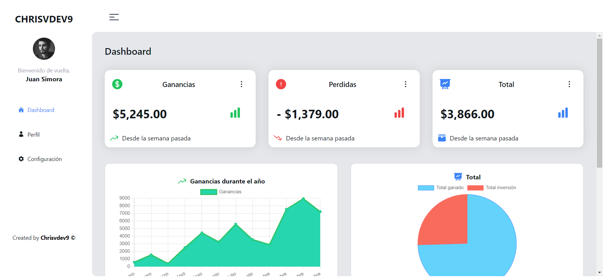

# Dashboard-Layout

He creado un dashboard en forma de Layout para que alguien lo reutilice. Utilicé Vite, NextUI, TailwindCss, React-chartjs, Chartjs para los gráficos y Headlessui para la transición.

Observaciones con NextUI (Septiembre - 2023):
- Se buguea al mezclarse con tailwind.
- La instalación se complica, revisen mi tailwind.config.js si tienen problemas.
- No pude utilizar una Card de NextUI con los gráficos se buguea.

:point_right: [Live preview](https://dashboard-layout-sigma.vercel.app/)

Imagen 1:

